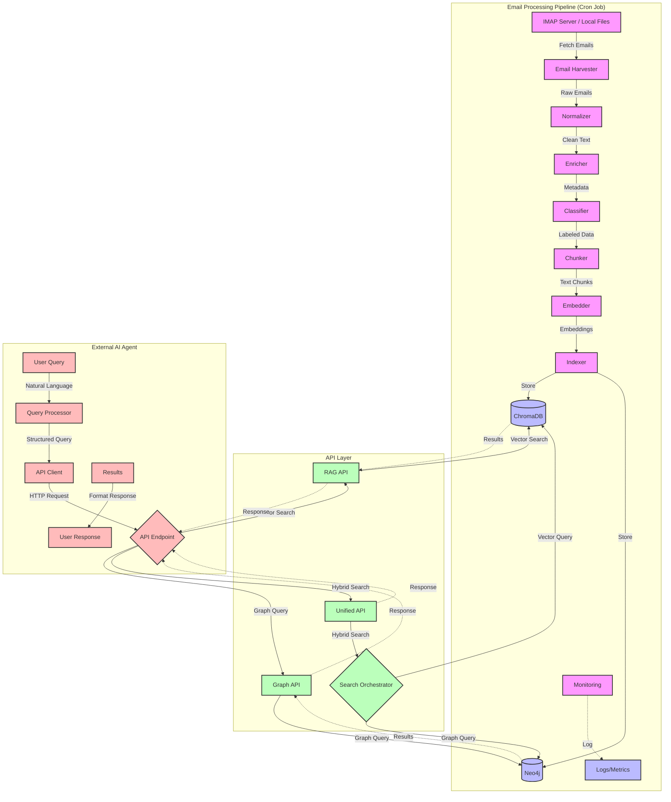

# VendorUpdater_Bot Flow Chart

## Flow Description

1. **Email Processing Pipeline** (runs as a cron job):
   - Harvests emails from IMAP server or local files
   - Normalizes and cleans the email content
   - Enriches with metadata and classifies content
   - Chunks text and generates embeddings
   - Stores data in both ChromaDB (vector store) and Neo4j (graph database)
   - Monitors performance and logs metrics

2. **API Layer** (provides query endpoints):
   - RAG API: Handles vector search queries using ChromaDB
   - Graph API: Handles relationship queries using Neo4j
   - Unified API: Combines both approaches for enhanced results

3. **External AI Agent** (runs in separate pod):
   - Processes user queries in natural language
   - Converts to structured queries for the API
   - Sends HTTP requests to the appropriate endpoint
   - Formats and presents results to the user

The main endpoint for the external AI agent to use is the `/query` endpoint in the RAG API (`rag_api.py`). This endpoint accepts a JSON payload with:
- `query`: The search query text
- `metadata_filters`: Optional filters for vendor, product, type, etc.
- `top_k`: Number of results to return

For more advanced relationship queries, the agent can use the Graph API endpoints or the future Unified API endpoint that will combine both vector and graph search capabilities.